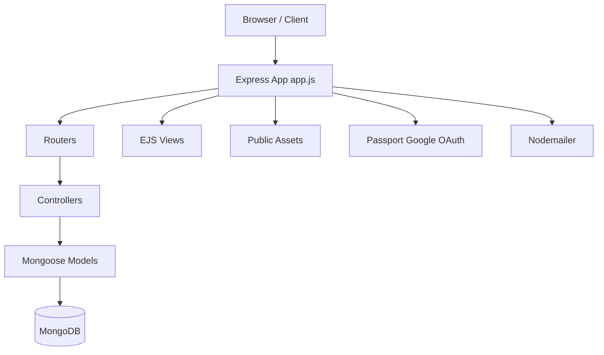

# Car Rental Website


A full-stack car rental platform built with **Node.js**, **Express**, **MongoDB**, and **EJS**.
It includes customer flows (browse/search/book), admin workflows (requests/bookings management), authentication (email/password + Google OAuth), localization, and checkout status tracking.

## Table of Contents

- [Features](#features)
- [Tech Stack](#tech-stack)
- [Project Structure](#project-structure)
- [Architecture Overview](#architecture-overview)
- [Getting Started](#getting-started)
- [Environment Variables](#environment-variables)
- [Run the App](#run-the-app)
- [Main Routes](#main-routes)
- [API Endpoints](#api-endpoints)
- [Data Models](#data-models)
- [Authentication Flows](#authentication-flows)
- [Internationalization](#internationalization)
- [Static Assets & Views](#static-assets--views)
- [Security Notes](#security-notes)
- [Known Gaps / Next Improvements](#known-gaps--next-improvements)
- [Contributing](#contributing)
- [License](#license)

## Features

- User registration and login with session-based auth
- Google OAuth login via Passport
- Forgot password flow with email verification code
- Car catalog with category/search filters
- Date-based availability search
- Car details page with rental session context
- Booking checkout flow with status lifecycle (`pending`, `confirmed`, `cancelled`, `completed`)
- Admin panel for requests and bookings
- Booking status lookup endpoint
- Cookie consent endpoints
- English/French localization via `i18n`

## Tech Stack

- **Backend:** Node.js, Express 5
- **Database:** MongoDB + Mongoose
- **Views:** EJS templates
- **Auth:** express-session, Passport (Google OAuth 2.0), bcrypt
- **Email:** Nodemailer (Gmail)
- **Uploads:** Multer
- **Localization:** i18n
- **Utilities/Middleware:** body-parser, morgan, cookie-parser, cors

## Project Structure

```text
Car_Rental/
|- app.js
|- package.json
|- config/
|  \- passport.js
|- controllers/
|  |- User.js
|  |- Car.js
|  \- admin.js
|- models/
|  |- user.js
|  |- car.js
|  |- booking.js
|  |- bookings.js
|  |- rentRequest.js
|  \- notification.js
|- routers/
|  |- users.js
|  |- cars.js
|  |- bookingroute.js
|  \- admins.js
|- views/
|  |- Admin/
|  \- partials/
|- public/
|  |- css/
|  |- JavaScript/
|  \- images/
|- locales/
|  |- en.json
|  \- fr.json
\- Utils/
   \- sendEmail.js
```

## Architecture Overview



## Getting Started

### 1) Prerequisites

- Node.js 18+
- npm 9+
- MongoDB database (local or Atlas)
- Google OAuth credentials (for Google login)
- Gmail app password (for reset emails)

### 2) Install dependencies

```bash
npm install
```

### 3) Create your `.env`

Create a `.env` file in project root.
Use this template:

```env
API_URL=/api/v1
CONNECTION_STRING=mongodb+srv://<username>:<password>@<cluster>/<db_name>

EMAIL_USER=your_email@gmail.com
EMAIL_PASS=your_gmail_app_password

GOOGLE_CLIENT_ID=your_google_client_id
GOOGLE_CLIENT_SECRET=your_google_client_secret
GOOGLE_CALLBACK_URL=http://localhost:3000/auth/google/callback
```

## Environment Variables

| Variable | Required | Description |
|---|---|---|
| `API_URL` | Yes | API prefix mounted for cars/users/admin routes |
| `CONNECTION_STRING` | Yes | MongoDB connection URI |
| `EMAIL_USER` | Yes (for reset flow) | Sender Gmail address for password reset |
| `EMAIL_PASS` | Yes (for reset flow) | Gmail app password |
| `GOOGLE_CLIENT_ID` | Yes (for Google auth) | OAuth client ID |
| `GOOGLE_CLIENT_SECRET` | Yes (for Google auth) | OAuth client secret |
| `GOOGLE_CALLBACK_URL` | Yes (for Google auth) | OAuth callback URL |

## Run the App

```bash
npm run dev
```

Or production:

```bash
npm start
```

Default server URL: `http://localhost:3000`

## Main Routes

### Web Routes

| Route | Method | Description |
|---|---|---|
| `/` | GET | Home page |
| `/explore` | GET | Car listing page |
| `/cars/:id` | GET | Car details fallback route |
| `/checkout` | GET | Checkout page |
| `/pending` | GET/POST | Pending page + booking creation |
| `/success` | GET | Booking success page |
| `/admin` | GET | Admin requests page |
| `/login` | GET | Login page |
| `/signup` | GET | Signup page |
| `/forgotpassword` | GET | Forgot password page |
| `/verify` | GET | Reset code verification page |
| `/resetpass` | GET | Password reset page |
| `/auth/google` | GET | Google auth entry |
| `/auth/google/callback` | GET | Google auth callback |
| `/lang/:locale` | GET | Language switch (`en`/`fr`) |

### API Prefix Routes

With `API_URL=/api/v1`:

- `/api/v1/cars` -> cars router
- `/api/v1/users` -> users router
- `/api/v1/admin` -> admin router
- `/api/booking` -> booking router

## API Endpoints

### Users (`/api/v1/users`)

- `POST /signup` - Register user
- `POST /login` - Login user
- `POST /forgot-password` - Send reset code
- `POST /verify-code` - Verify code
- `POST /reset-password` - Set new password
- `GET /logout` - Destroy session
- `GET /` - List all users
- `GET /:userId/notifications` - User notifications

### Cars (`/api/v1/cars`)

- `GET /` - List/search cars
- `GET /inside/:id` - Single car page
- `GET /featured` - Featured cars JSON
- `GET /search` - Alias search route
- `GET /available` - Date/city availability search
- `GET /store-dates` - Store dates in session
- `GET /AddCars` - Add car form page
- `POST /` - Add car
- `PUT /inside/:id` - Edit car

### Admin (`/api/v1/admin`)

- `GET /requests` - All rent requests
- `GET /requests/details/:id` - Request details
- `POST /requests/accept/:id` - Approve request
- `POST /requests/decline/:id` - Decline request
- `GET /bookings` - All bookings
- `GET /bookings/details/:id` - Booking details

### Booking & Checkout

- `GET /api/booking/status/:bookingRef` - Booking status lookup
- `POST /api/booking/upload` - Upload identity image
- `POST /process-payment` - Update booking to processing state
- `POST /admin/booking/:id/status` - Update booking status

## Data Models

### `User`

- Profile: first/last name, email, phone, birthdate
- Auth: hashed password, role (`client`/`admin`)
- Password reset: `resetCode`, `resetCodeExpires`

### `Car`

- Core details: name, brand, city, images, pricing, category
- Flags: `available`, `featured`
- Specs: seats, horsepower, cylinders, maxSpeed, model

### `Booking` (`checkout` collection)

- Customer contact and address data
- Payment method and summary fields
- Booking reference auto-generation (`NW-YYYY-XXXXXX`)
- Status lifecycle: `pending`, `confirmed`, `cancelled`, `completed`

### `bookings` (rental bookings)

- Links `userId` and `carId`
- Rental window (`rentStart`, `rentEnd`)
- Booking status (`booked`)

### `rentRequest`

- Rental request from user to admin
- Request dates and entity references

### `notification`

- Notification content per user
- Timestamped entries

## Authentication Flows

### Email/Password

1. User signs up (`bcrypt` hash stored)
2. User logs in (`express-session` stores user)
3. Role-based redirect (`admin` -> `/admin`, `client` -> `/`)

### Forgot Password

1. `POST /api/v1/users/forgot-password`
2. Code emailed via Nodemailer (Gmail)
3. `POST /api/v1/users/verify-code`
4. `POST /api/v1/users/reset-password`

### Google OAuth

1. `GET /auth/google`
2. Google callback to `/auth/google/callback`
3. Passport profile saved to session

## Internationalization

- Configured locales: `en`, `fr`
- Locale sources in `locales/en.json` and `locales/fr.json`
- Query parameter supported: `?lang=en` or `?lang=fr`
- Cookie-based language persistence via `/lang/:locale`

## Static Assets & Views

- Views under `views/` (EJS)
- Reusable parts in `views/partials/`
- Admin templates in `views/Admin/`
- Frontend assets in `public/css`, `public/JavaScript`, `public/images`

## Security Notes

- Do **not** commit real `.env` secrets to source control.
- Rotate any exposed credentials immediately.
- For production, secure sessions (`cookie.secure: true` behind HTTPS).
- Avoid storing full card/payment details server-side.
- Add request validation/sanitization for all write endpoints.

## Known Gaps / Next Improvements

- Add automated tests (unit + integration)
- Add centralized input validation (e.g., Joi/Zod)
- Enforce auth/role middleware on admin routes
- Add CSRF protection and rate limiting
- Normalize model naming (`booking.js` vs `bookings.js`)
- Add `.env.example` and remove hardcoded/committed secrets
- Add CI workflow for lint + tests

## Contributing

1. Fork the repository
2. Create a feature branch
3. Commit your changes
4. Open a pull request with a clear description
